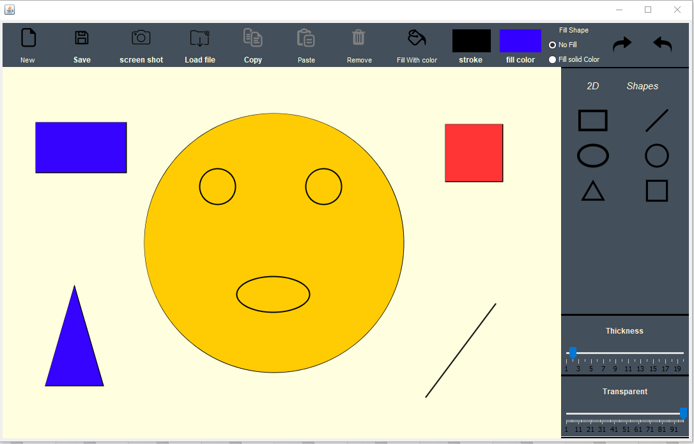

# Vector-Based-Drawing-Application
desktop application mimics painter app features to draw most of geometric shapes with move, resize, undo, redo, save and load using java and applying object oriented programming concept. [jar file ](https://github.com/Aboeleneen/Vector-Based-Drawing-Application/raw/master/paint.jar)

## Features :
  - Selecting a certain outline color and fill color.
  - Resizing any of the shapes.
  - Moving shapes within the drawing board.
  - Deleting any drawn shape.
  - Copy and paste drawn shapes.
  - Undo and redo actions .
  - Saving and loading any of the drawings where two file saving formats are supported, XML&Json.
  - Take a snapshot to the board 
  - Change the stroke thickness. 
  - Change the transparent of shapes.
  - Create a new grid using the new option.

## user manual :

  1. Radio button to select NoFill mode to draw a shape without fill color or FillSolidColor mode to draw a complete shape.
  2. Six buttons to select the shape which you want to
  draw by click on it.
  3.slider to change the thickness of the shape.
  4.slider to change the transparent of the shape.
  5. colorChooser to select stroke color.
  6. colorChooser to select fill color. 
  7. Button to change the fill color of the selected shape by clicking on the button then clicking on the shape.
  8. To remove the shape after selecting it.
  9. Button to copy the selected shape.
  10. Button to paste the copied shape then you can move it a new position.
  11. fileChooser to select a position to save the program and load it later
  12. fileChooser to select a position to save a screen shot of program .
  13. fileChooser to select a file with extension xml or json to load it to the program.
  14. Button to clear the grid and make a new one.
  15. Undo and redo actions . 
  
## code design :
  - Shape2D Class :
    - Inherit from Shape interface and include all the common methods supported by the shapes where each shape inherit from it. 
  - Some shapes extends from other shapes for example square is extended from rectangle and circle is extended from ellipse. 
  - PaintEngine Class :
    - Inherit from DrawingEngine interface and include all actions in the program for example:
      - Add Shape : to add a new shape
      - Remove shape : to remove the select shape
      - Update shape : to add a new properties to the select shape.
      - Undo : to remove an action from undo stack then add it to redo stack
      - Redo: to remove an action from redo stack than add it to undo stack.
      - installPluginShape: to extend shape jar and add it to the program.
      - Save : to save the shapes in xml or json file.
      - Load : to load an xml or json file. 
  - Shape Factory class :
    - Inherit from abstract Factory and return a new shape depended on the select current shape. 
  - Board class :
    - Panel where we draw so we add to add mouse listeners .
  - PaintApp class :
    - frame which contains all components and we use it as controller for our program. 
  - Json class  :
    - To save shapes in json file and load it later. 
  - Xml class :
    - To save shapes in xml file and load it later. 
